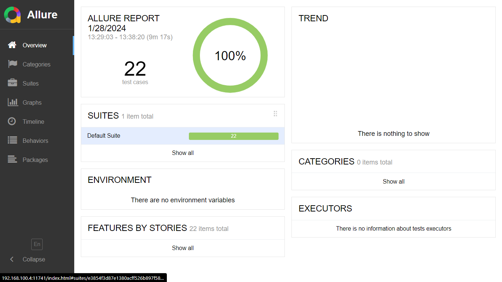
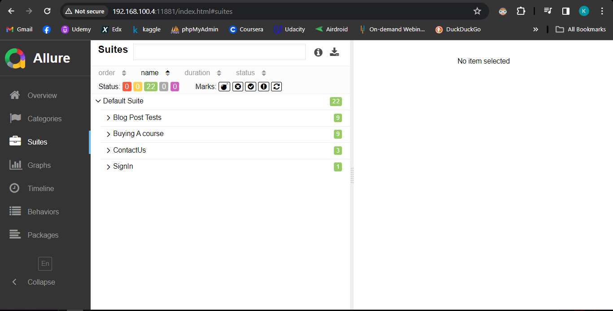

# Test Automation of ultimateqa.com
## Overview 
This repository contains a test automation project for ultimateqa.com using Java, TestNG, Selenium, and Allure report. The automation suite consists of approximately 20 test cases covering various functionalities of the Ultimate QA website.

## Prerequisites
Ensure you have the following installed on your local machine:

1. Java Development Kit (JDK) version 11 or later 
2. Java IDE (Eclipse or Intellij )
3. Chrome Browser or Edge Browser 
4. Allure installed on the machine

## Setup 
git clone https://github.com/your-username/ultimateqa-test-automation.git
cd ultimateqa-test-automation

### Running the Project 

  1. Open the Java IDE
  2. Open the cloned folder of this repository from the IDE 
  3. Update the Maven project from the Editor
       * Use GUI to update Maven Project or,
       * Use command terminal
         ``` Bash
         mvn clean install -U
         ```
  4. Open the java file from  `/src/test/tests/`  </br>
  5. Select the Test Page  and open the Java file 
  5. Now to run the file:  </br>
    * Can run the script as testNG suite or </br>
    * run each test using the run option beside the `@Test`  annotation before each test case.(For Eclipse [TestNG for Eclipse](https://marketplace.eclipse.org/content/testng-eclipse) should be installed in Eclipse) [see this](https://www.guru99.com/install-testng-in-eclipse.html) for more information.

## Reports 
Allure Report is used in this repository for report generation. To create an allure report after test execution, go to the terminal and navigate to the project folder. And run:
1. `allure serve`. This creates the same report Allure generates but puts it into a temporary directory and starts a local web server configured to show this directory's contents.
2. `allure generate.` This command processes the test results and saves an HTML report into the allure-report directory. To view the report, use the allure open command.
### The report of this project can be found under `src/allure-report/index.html`.
Some pictures of allure results of this project:
![Total Case 
## License
This project is licensed under the MIT License.
<br>



